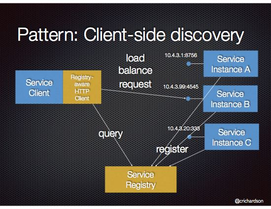

# Service discovery 

### the good the bad and the k8s

---

## The definition


> Service discovery is how applications and (micro)services locate each other on a network

[source](https://www.getambassador.io/resources/service-discovery-microservices/)


> Service discovery is the automatic detection of devices and services offered by these devices on a computer network.

[source](https://en.wikipedia.org/wiki/Service_discovery)


---

## The problem


[source](https://www.nginx.com/blog/service-discovery-in-a-microservices-architecture/)
---

    
## Why do we need service discovery? 

* reduce effort

* discover each other dynamically

* health monitoring

* load balancing


---

## Kinds of Service Discovery

* Server-side service discovery
* Client-side service discovery

---

## Server-side service discovery

> When making a request to a service, the client makes a request via a router (a.k.a load balancer) that runs at a well known location. The router queries a service registry, which might be built into the router, and forwards the request to an available service instance.

[source](https://microservices.io/patterns/server-side-discovery.html)


---

## Server-side service discovery


---

## Client-side service discovery

> When making a request to a service, the client obtains the location of a service instance by querying a Service Registry, which knows the locations of all service instances.

[source](https://microservices.io/patterns/client-side-discovery.html)

---

## Client-side service discovery



---

## Implementations

* DNS Service Discovery (DNS-SD)
* Service Location Protocol (SLP)
* Apache Zookeeper, Consul, etcd, Netflix Eureka etc.


---

## k8s - basics

- deplpyment
- pod
- service
- ingress

Note: 
ingress exposes services)
---

## k8s - basics


---

## Service

- server-side service discovery
- load balancer
- relies on readiness ~~and liveness~~ probes 
- uses selectors

---

## Service - example

```yaml
apiVersion: v1
kind: Service                      (1)
metadata:
  name: my-service
spec:
  selector:
    app: MyApp                     (2)
  ports:
    - protocol: TCP
      port: 80                     (3)
      targetPort: 9376
```

---

## Netflix Eureka


[source](https://www.codeprimers.com/client-side-service-discovery-in-spring-boot-with-netflix-eureka/)

---

## Netflix Eureka - core elements

* Service registry
* Eureka client

---

## Ribbon


[source](https://www.javaxp.com/2020/06/client-side-load-balancing-using-eureka.html)


---

## Spring + Eureka + Ribbon


---

## Spring + Eureka + Ribbon + k8s


---

# Lessons Learned

---

## Refresh interval is crucial

* eureka server (many parameters)
* eureka client (`registryFetchIntervalSeconds`)
* ribbon (`ServerListRefreshInterval`)

Note: 
client-side load balancers need to get the  new list of services

---

## k8s readiness and liveness probes vs Eureka

* Eureka has its own solutions
* k8s solutions control Pods, impact Services and Ingresses

---

## Eureka self-preservation mode and k8s can be tricky

> The mechanism that stops evicting the instances when the heartbeats are below the expected threshold is called self-preservation. This might happen in the case of a poor network partition, where the instances are still up, but just can't be reached for a moment or in the case of an abrupt client shutdown.

[source](https://www.baeldung.com/eureka-self-preservation-renewal)

---

## Graceful shutdown
 
always...

Note: 
deregister from external systems, brokers, databases etc.
create a proper dockerfile configuration
use readiness and liveness

---

## Ugly solution 
### "Delayed" shutdown

* have a custom shutdown endpoint
* check your configuration and count time
* deregister the service but do not stop it yet
* wait for refreshing list of services by all instances
* stop it now

---
